# Task Management & AI Analyzer (CampusTask-Pro)

### 🌐 Live Demo: [https://02email.online/](https://02email.online/)

### 📺 Video Demonstration

https://github.com/user-attachments/assets/5d0fb1f5-31ca-4305-89de-663bfdd8ef6a

---

A centralized, AI-enhanced productivity system developed specifically to cater to the rigorous demands of students. This platform unifies assignment tracking, secure lecture material storage, and advanced Artificial Intelligence study guidance (powered by Google Gemini 2.5 Flash) into a single, intuitive interface.

## 🚀 Features

### 👨‍🎓 Student Workspace

- **Centralized Task Management:** Create, Read, Update, and Delete assignments via responsive modal pop-ups without page reloads.
- **AI-Powered Study Guidance:** Get time completion estimates, step-by-step milestone study plans, and targeted academic advice generated by AI.
- **Secure File Attachments:** Attach and store lecture materials (PDFs, PPTx) directly to tasks for easy access.
- **Interactive Dashboard:** Visual summary of workload, pending assignments, and completion ratios.
- **Dark Mode Support:** Fully responsive native dark mode for late-night study sessions.

### 🛡️ Administrative Portal

- **Isolated Security Routing:** Dedicated `/admin` login path protected by custom middleware to prevent standard user access.
- **Global Statistical Dashboard:** Visual metrics powered by Chart.js displaying system-wide completion rates and active platform usage.
- **Session Tracking:** Custom backend middleware that logs active time spent by students on the platform.
- **User Logs & Activity Matrix:** Monitor registered users, track task counts, and manage overall engagement levels.

## 🛠️ Technology Stack

- **Backend:** Laravel 12 (PHP 8.2)
- **Frontend UI:** Tailwind CSS (Utility-first framework)
- **Frontend Logic:** Alpine.js (Reactive state management)
- **Analytics:** Chart.js
- **Artificial Intelligence:** Google Gemini 2.5 Flash API

---

## 📸 Application Screenshots

### Public Interface

**Landing Page** 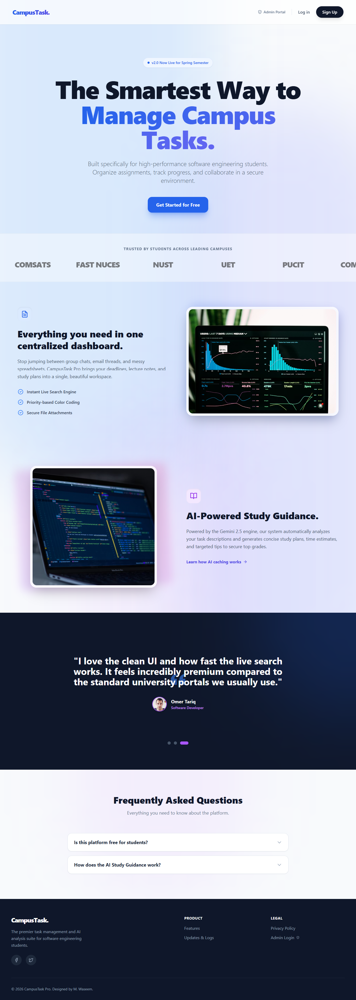

**Sign Up** 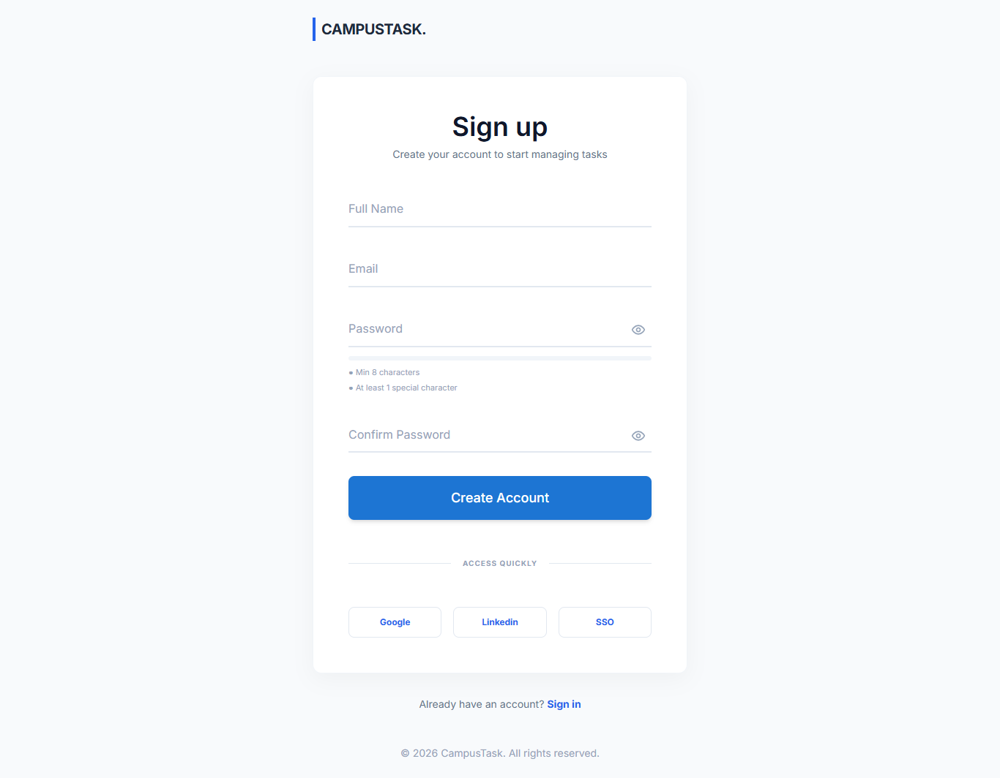

**Login** 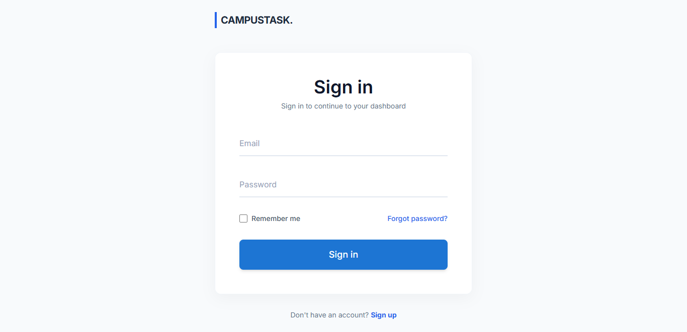

### Student Workspace

**User Dashboard (with AI Results)** 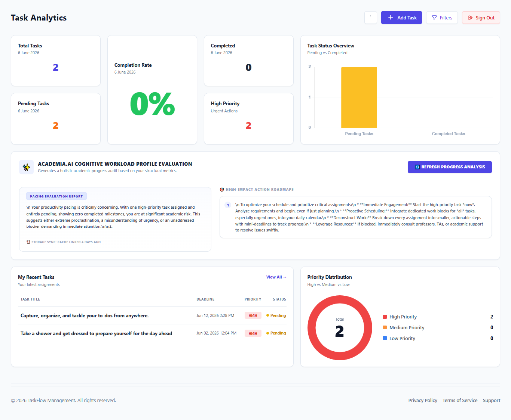

**Task Management Overview (Light Mode)** 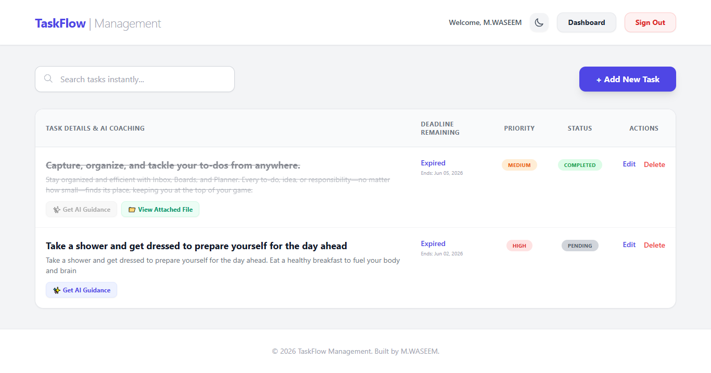

**Task Management Overview (Dark Mode)** 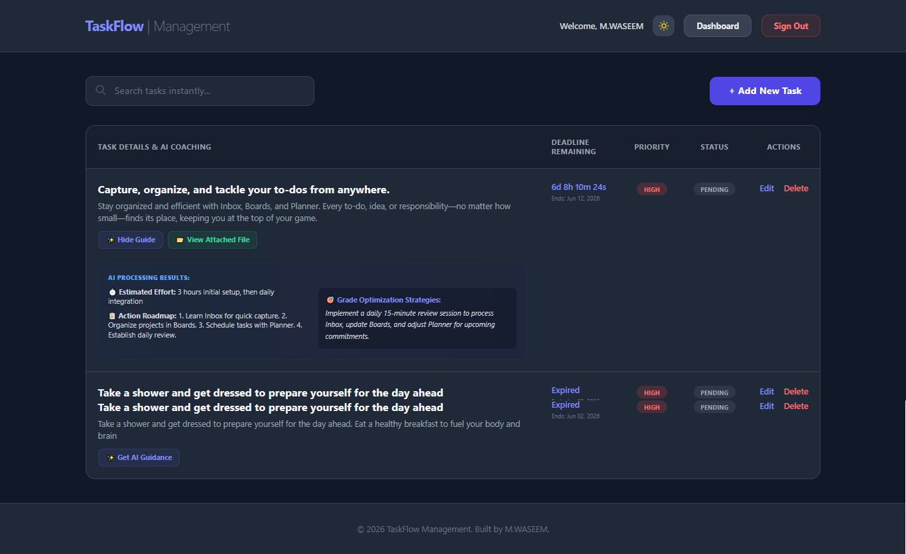

**AI Guidance & Task Details** 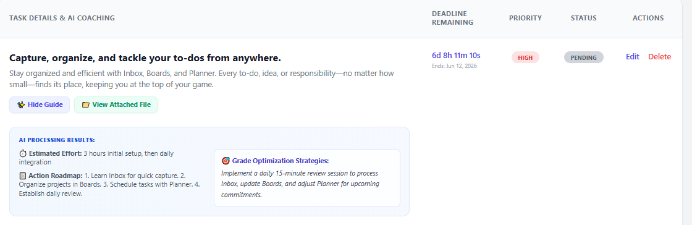

**Add Task** 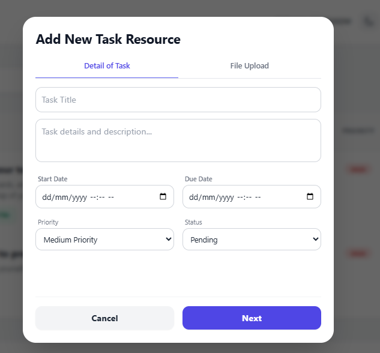

**Attach File** 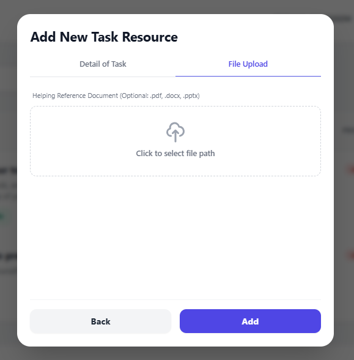

**Update Task** 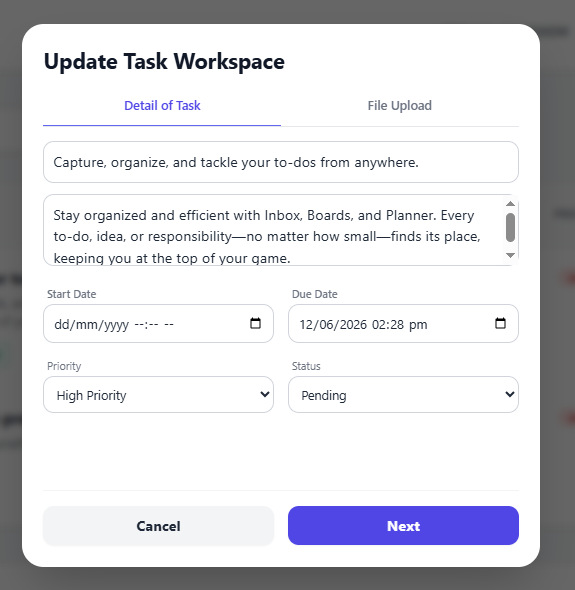

**Update File** 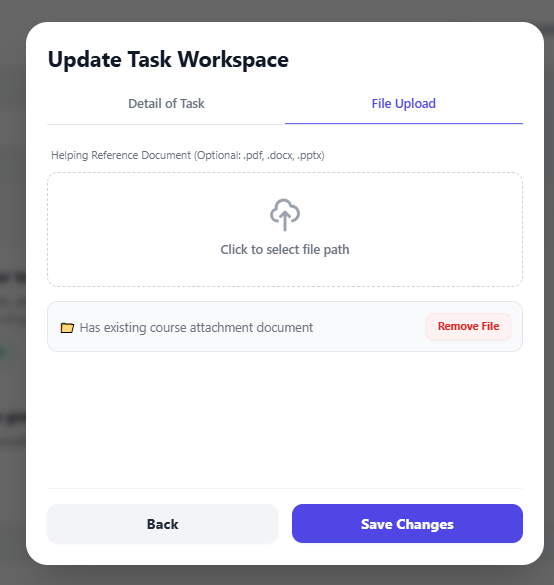

**Delete Prompt** 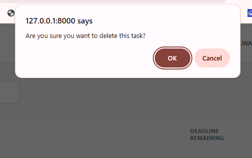

### Administrative Portal

**Admin Authentication** 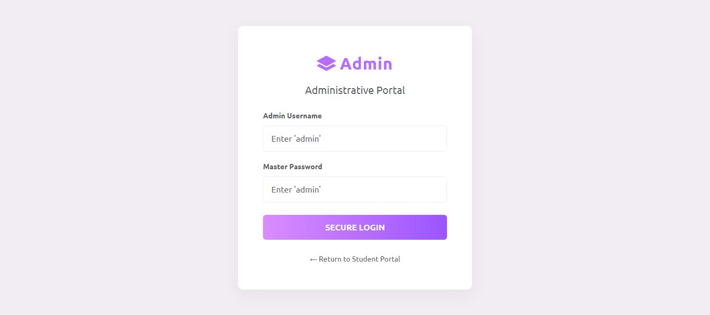

**Admin Dashboard Overview (Light Mode)** 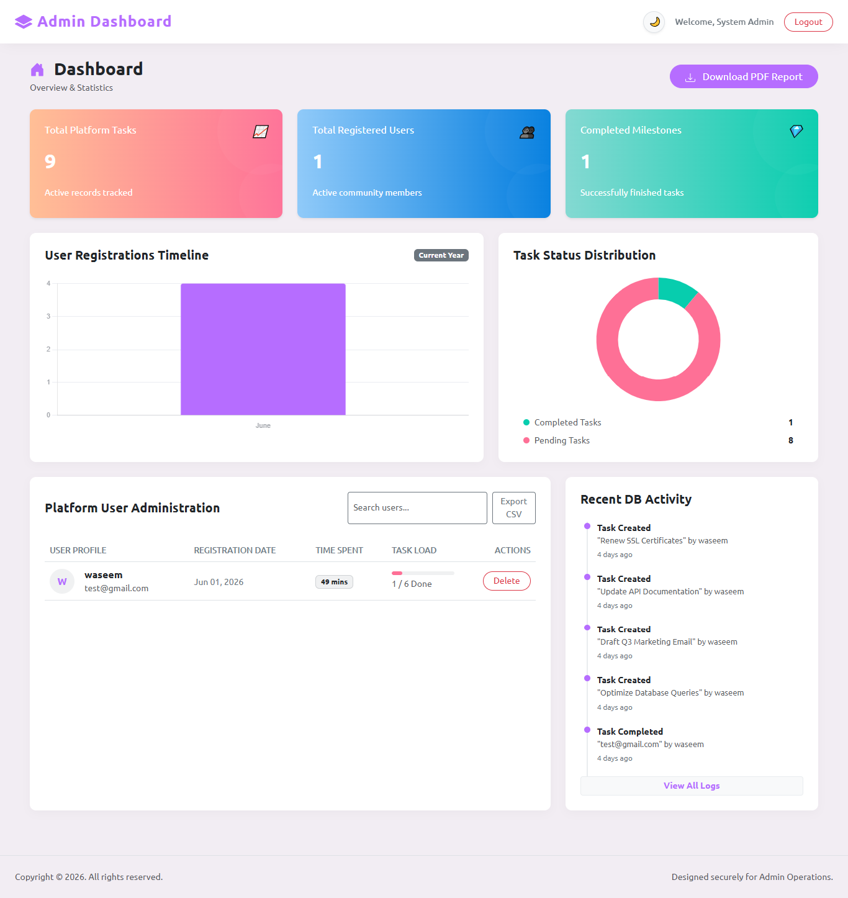

**Admin Dashboard Overview (Dark Mode)** 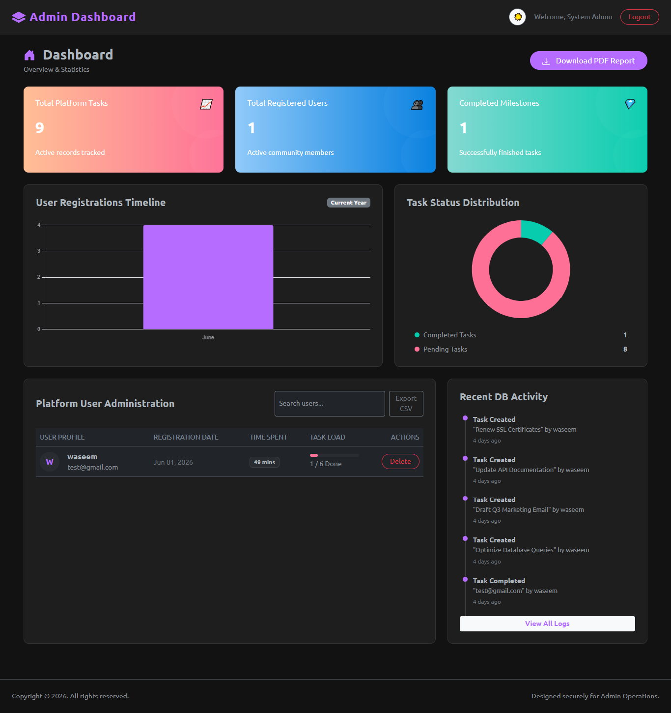

**User Management Matrix** 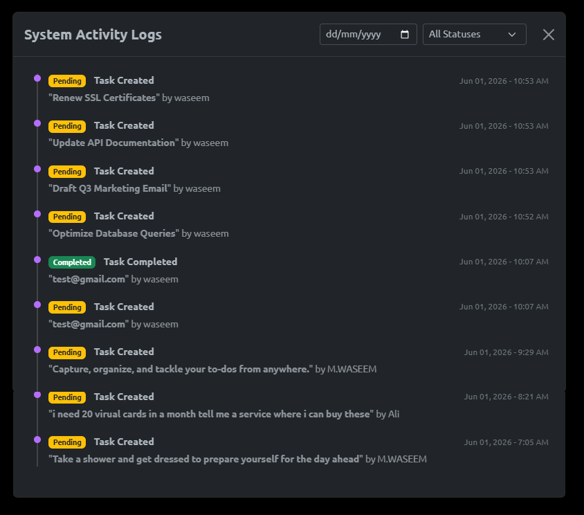

---

## ⚙️ Installation & Setup

1. **Clone the repository**
    ```bash
    git clone [https://github.com/mwaseem3703/web_technology_final_lab.git](https://github.com/mwaseem3703/web_technology_final_lab.git)
    cd web_technology_final_lab
    ```
